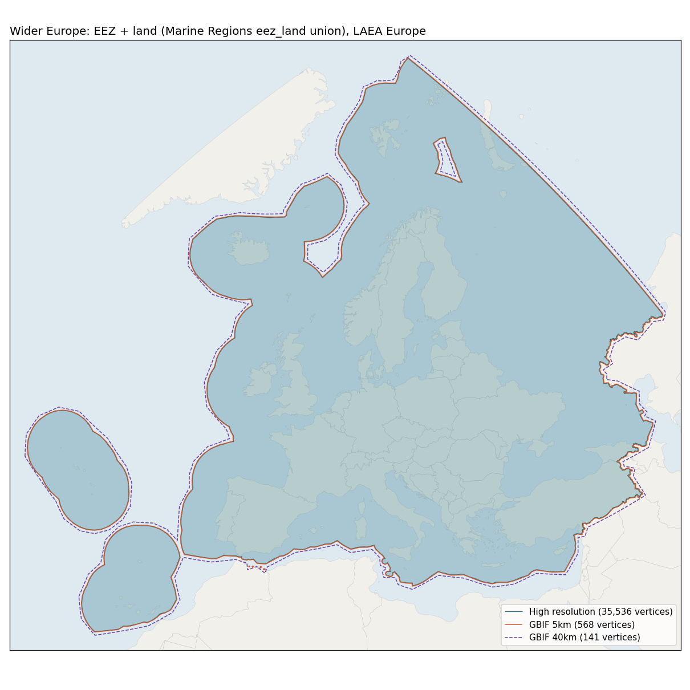

# Wider Europe: EEZ + land polygons

Built 2026-09-30 for the GuardIAS GBIF counts. One polygon covering the land and Exclusive Economic Zones of wider Europe, in a high-resolution version and in simplified versions sized for GBIF.



## Source

Layer `MarineRegions:eez_land`, "Marine and land zones: the union of world country boundaries and EEZ's", Flanders Marine Institute (VLIZ), fetched from the Marine Regions WFS (https://geo.vliz.be/geoserver/MarineRegions/wfs) on 2026-09-30. Licence CC-BY 4.0. Cite the exact version listed on https://www.marineregions.org/ when publishing.

Because the source is a union of land and sea, coastlines are not part of the geometry. Only the outer EEZ limits and land borders remain, which keeps even the full-resolution file small.

## Scope

71 source features, listed in `wider_europe_eez_land_territories.csv`:

- EU27, including the outermost regions Azores, Madeira and Canary Islands, plus Ceuta, Melilla and the other Spanish territories on the Moroccan coast.
- UK with Isle of Man, Guernsey and Jersey; Gibraltar.
- Norway with Svalbard and Jan Mayen; Iceland; Faroe Islands.
- Switzerland, Liechtenstein, Andorra, Monaco, San Marino, Vatican City.
- Western Balkans (Serbia includes Kosovo in the source), Ukraine, Moldova, Belarus.
- Turkey, Cyprus, Georgia.
- Russia, clipped to west of 60°E (European Russia, Baltic, Barents Sea, western Kara Sea, Black Sea and Azov coasts).
- Joint regime areas involving these countries.

Not included: Greenland, French overseas territories, North Africa, the Levant, Armenia, Azerbaijan, Kazakhstan.

## Processing

1. Union of all features, with Russia clipped at 60°E.
2. About 830 sliver holes between neighbouring EEZ polygons (all under 200 km², including a 185 km² gap in the Danube delta) were filled. Holes of 1,000 km² or more are kept. Only one exists: the Barents Sea "Loophole", a 75,000 km² high-seas enclave between the Norwegian and Russian EEZs.
3. Simplified versions: buffer outwards by N km (in ETRS89-LAEA), then Douglas-Peucker simplification in lon/lat with a tolerance of 0.8 × N km in degrees of latitude. Because the tolerance is smaller than the buffer, every simplified version fully contains the high-resolution polygon. This holds with edges read as straight lines in lon/lat, which is how GBIF evaluates them (checked: missed area < 0.01 km² for every version).
4. Exterior rings are anticlockwise and holes clockwise, as GBIF requires.

## Files

| File | Vertices | WKT characters | Extra area vs high-res | Use |
|---|---|---|---|---|
| `wider_europe_eez_land_hires.*` (.geojson, .gpkg, .wkt) | 35,536 | 759k | 0 | Mapping, spatial joins, post-filtering a download |
| `wider_europe_eez_land_gbif_5km.wkt` | 568 | 7,974 | +1.4% | GBIF download predicate (recommended) |
| `wider_europe_eez_land_gbif_10km.wkt` | 372 | 5,263 | +2.0% | GBIF download predicate |
| `wider_europe_eez_land_gbif_20km.wkt` | 234 | 3,321 | +3.4% | GBIF download predicate |
| `wider_europe_eez_land_gbif_40km.wkt` | 141 | 1,716 | +6.1% | GBIF occurrence **search** API (GET URLs) and the GBIF website |

`wider_europe_eez_land_gbif_simplified.geojson` holds the four simplified versions as features. `gbif_download_request_example.json` is a download request body using the 5 km polygon. Add your username, e-mail and taxon filter before POSTing it to `https://api.gbif.org/v1/occurrence/download/request`.

`make_polygons.py` rebuilds the WKT files from the WFS:

```bash
uv run --with requests --with 'shapely>=2.1' --with pyproj python make_polygons.py
```

Re-run on 2026-09-30 against the same source data, it reproduces the high-resolution, 10 km, 20 km and 40 km WKT files byte for byte. The 5 km file came out with one coordinate differing in the last decimal (`55.682` instead of `55.681`). The GeoPackage, the preview, the territories CSV, the combined simplified GeoJSON and the example request were produced separately and are not regenerated by the script. The script also writes its own GeoJSON files (one per version, plus the raw WFS download) in the current directory, in a different layout from the ones committed here, so run it from a scratch directory unless you mean to replace them.

## Notes for GBIF use

- The occurrence search API is GET only and rejects URLs longer than about 4,000 characters (tested: 2.9k OK, 4.3k rejected). Only the 40 km version fits. Downloads are POSTed as JSON and have no such limit.
- Tested on the live search API on 2026-09-30: the 40 km polygon returns 1,351,051,166 PRESENT records (versus 1,327,149,059 for `continent=EUROPE`). A test square inside the Barents Loophole is correctly excluded.
- The simplified versions reach slightly beyond the EEZ limits (by up to the buffer width). For exact counts, download with a simplified polygon, then filter the records against the high-resolution polygon.
- Overlapping claims involving an in-scope country are included (Gibraltar, the Spanish territories off Morocco). Maritime boundaries follow Marine Regions and are not an endorsement of any claim.
